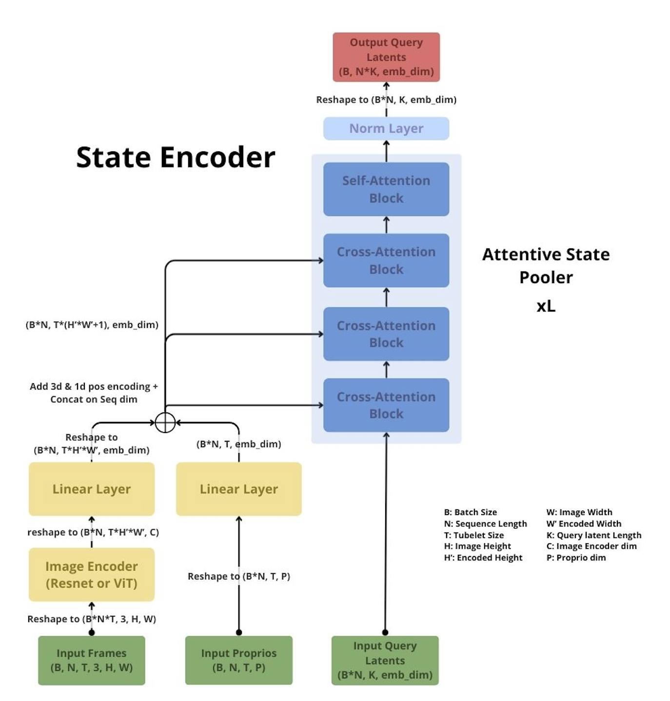

# ebt-wm

Implementing a JEPA-style World Model using the Energy-Based-Transformer, an Attentive State Pooler and LeJEPA loss.

## State Encoder

The State Encoder is composed of an image backbone followed by an attentive state pooler that aggregates spatial & temporal features as well as proprioception into a compact latent state representation of K tokens.

This State Encoder is meant to be trained jointly with the Predictor using the reconstruction loss and the SIGReg regularization.

    

